# Лабораторно-практична робота №5

### «Розширення бекенд-додатку власними сутностями та реалізація REST API»

---

## Реалізовані сутності та їх зв’язки

### Діаграма інформаційної системи

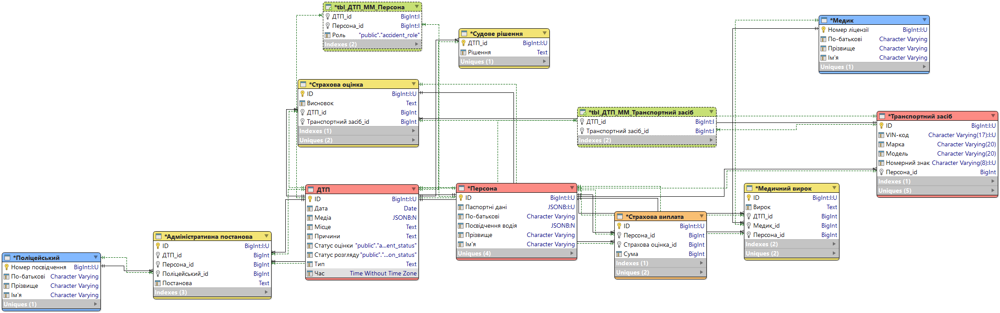

### Опис

- **Accident** — містить усі дані специфічні до ДТП
- **Person** — містить інформацію про персону
- **Vehicle** — містить інформацію про транспортний засіб
- Було також реалізовано усі інші сутності з діаграми

**Зв’язок:** ManyToMany між Accident-Person та Accident-Vehicle. OneToOne між Person-Vehicle.

---

## Реалізовані API ендпоінти

### Accident

- `POST /v1/accidents` — створення запису
- `GET /v1/accidents` — отримання всіх записів
- `GET /v1/accidents/:id` — отримання запису за ID
- `PATCH /v1/accidents/:id` — оновлення запису
- `DELETE /v1/accidents/:id` — видалення запису

### Person

- `POST /v1/persons` — створення запису
- `GET /v1/persons` — отримання всіх записів
- `GET /v1/persons/:id` — отримання запису за ID
- `PATCH /v1/persons/:id` — оновлення запису
- `DELETE /v1/persons/:id` — видалення запису

### Vehicle

- `POST /v1/vehicle` — створення запису
- `GET /v1/vehicle` — отримання всіх записів
- `GET /v1/vehicle/:id` — отримання запису за ID
- `PATCH /v1/vehicle/:id` — оновлення запису
- `DELETE /v1/vehicle/:id` — видалення запису

---

## Результати тестування (скріншоти Postman)

### Accident

- `POST /v1/accidents`
  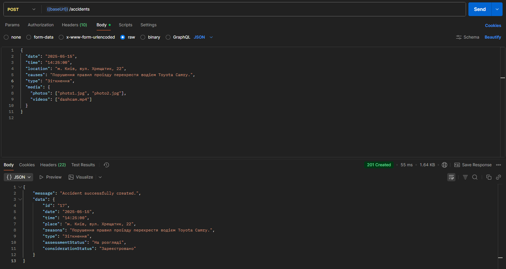

- `GET /v1/accidents`
  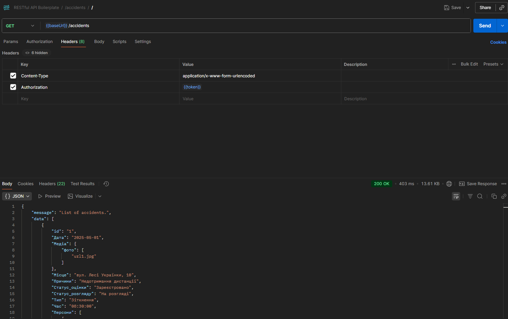

- `GET /v1/accidents/:id`
  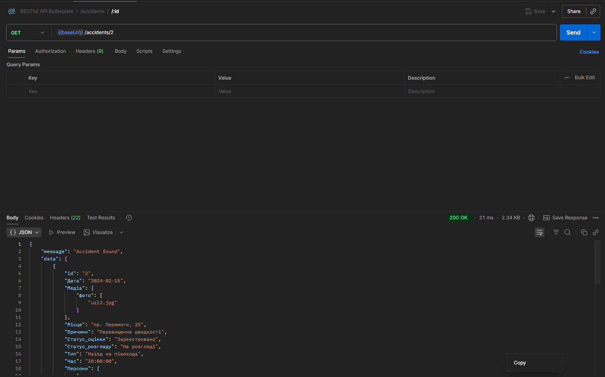

- `PATCH /v1/accidents/:id`
  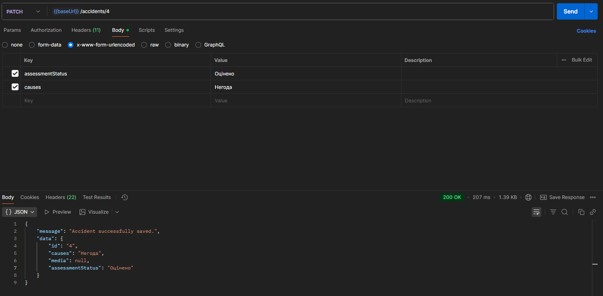

- `DELETE /v1/accidents/:id`
  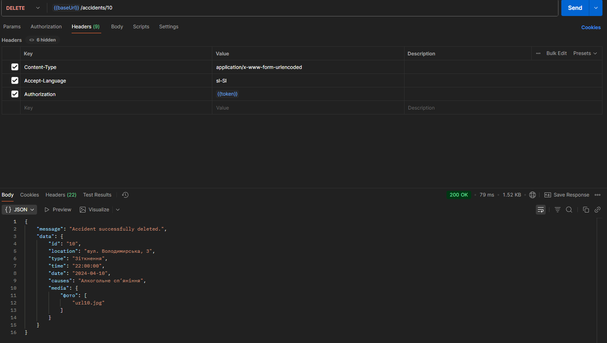

### Person

- `POST /v1/persons`
  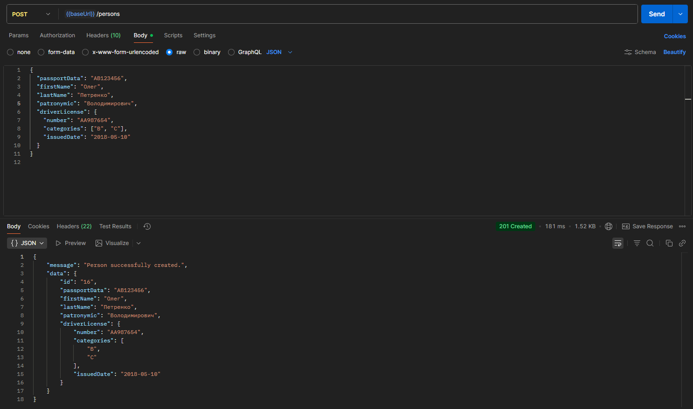

- `GET /v1/persons`
  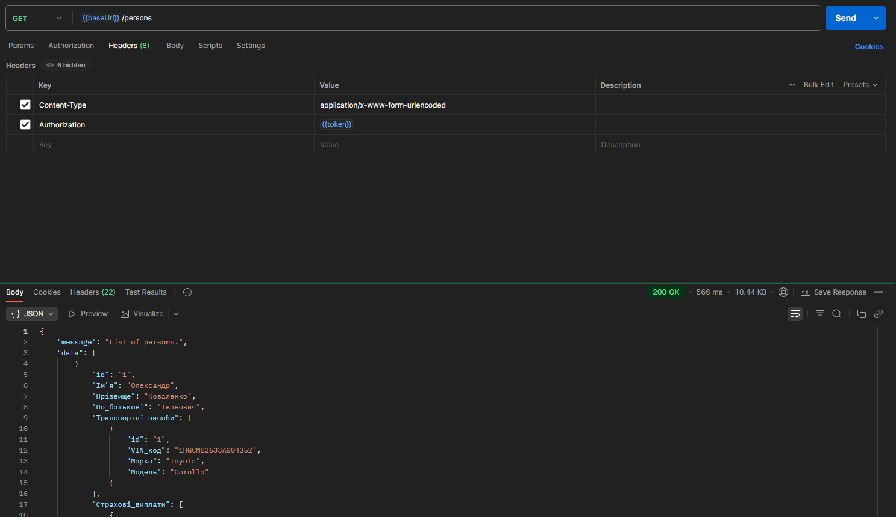

- `GET /v1/persons/:id`
  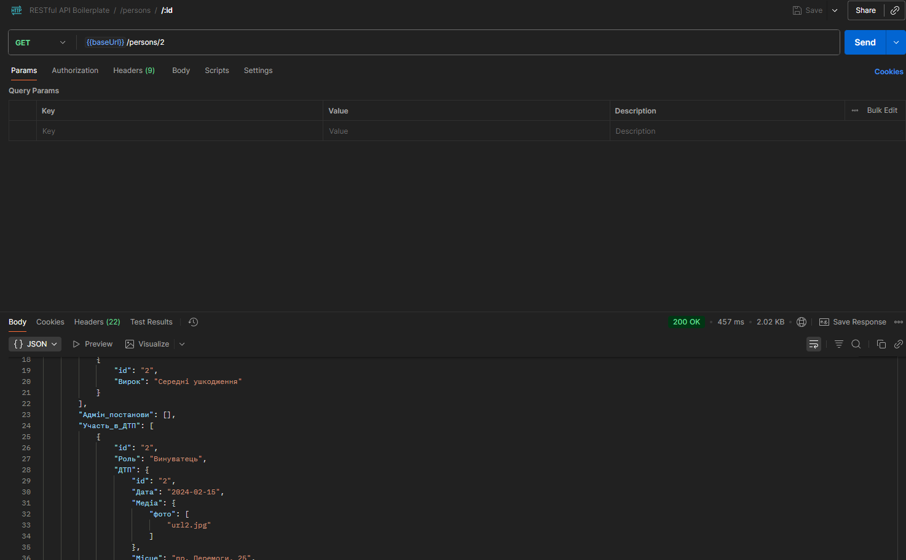

- `PATCH /v1/persons/:id`
  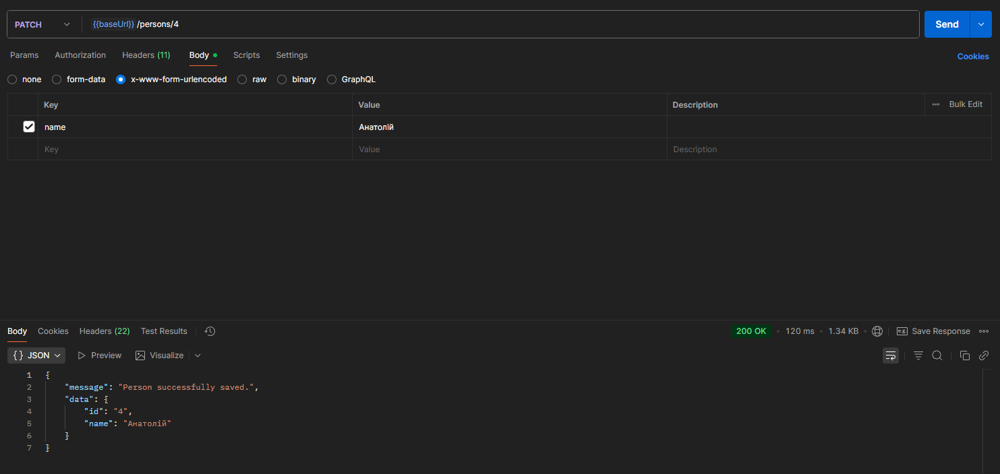

- `DELETE /v1/persons/:id`
  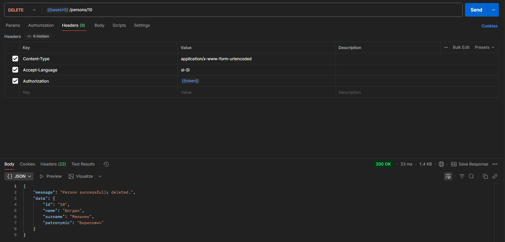

### Vehicle

- `POST /v1/vehicles`
  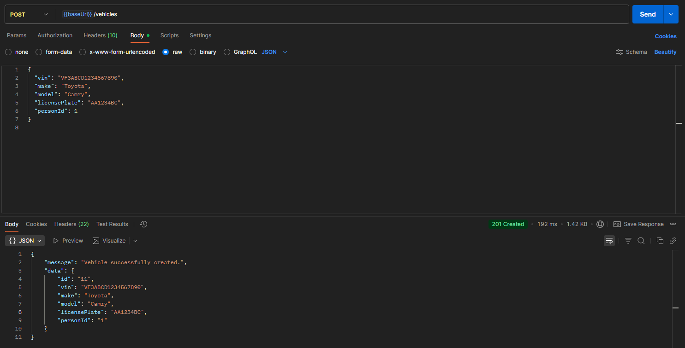

- `GET /v1/vehicles`
  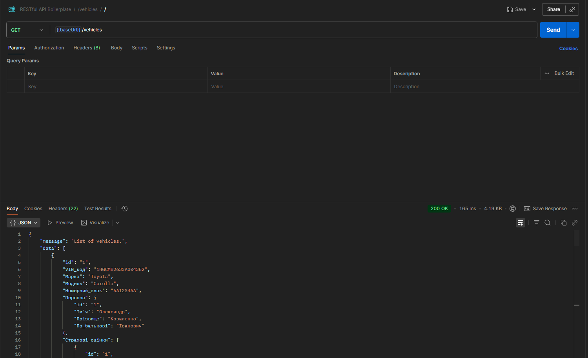

- `GET /v1/vehicles/:id`
  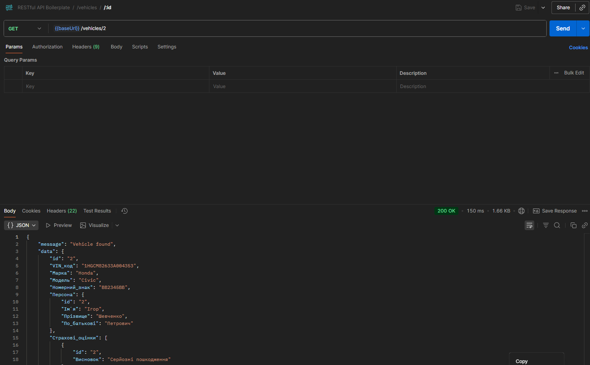

- `PATCH /v1/vehicles/:id`
  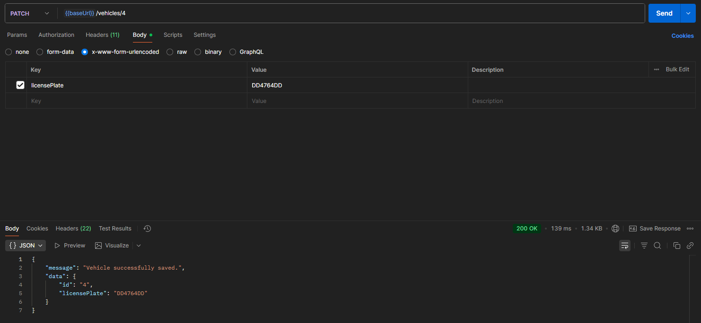

- `DELETE /v1/vehicles/:id`
  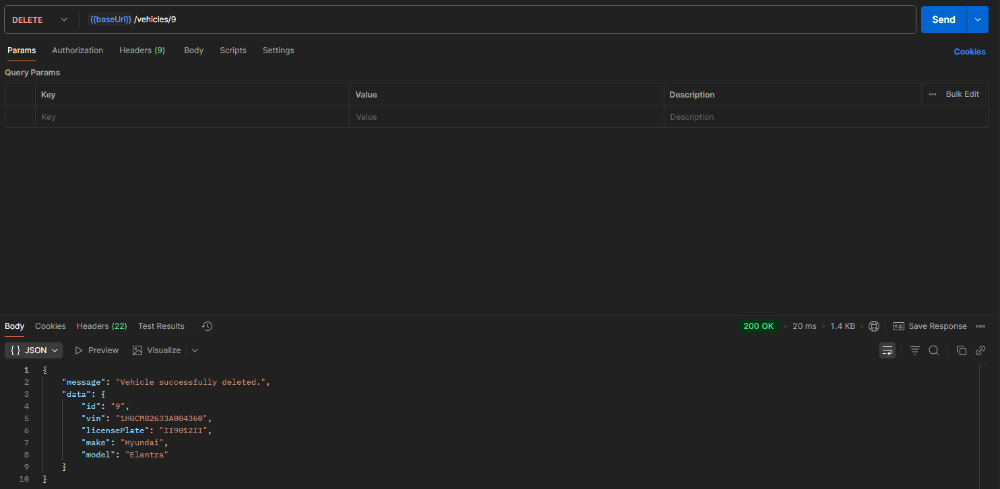
