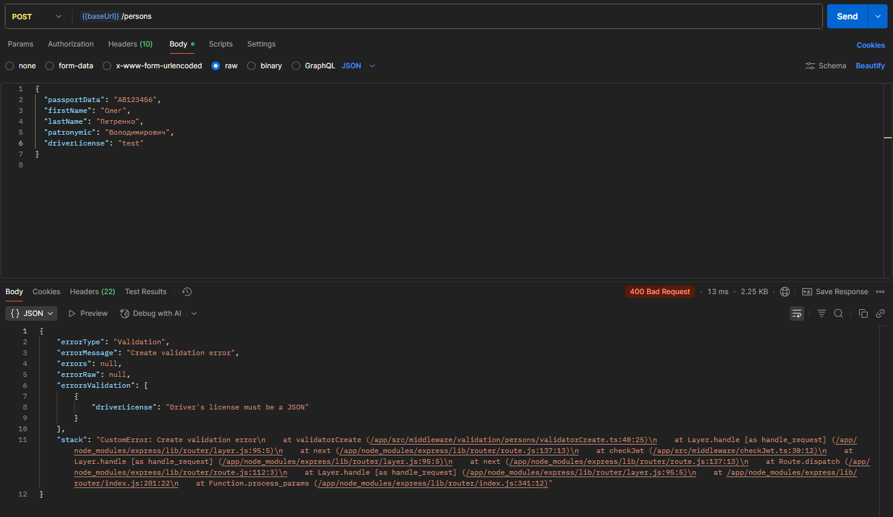
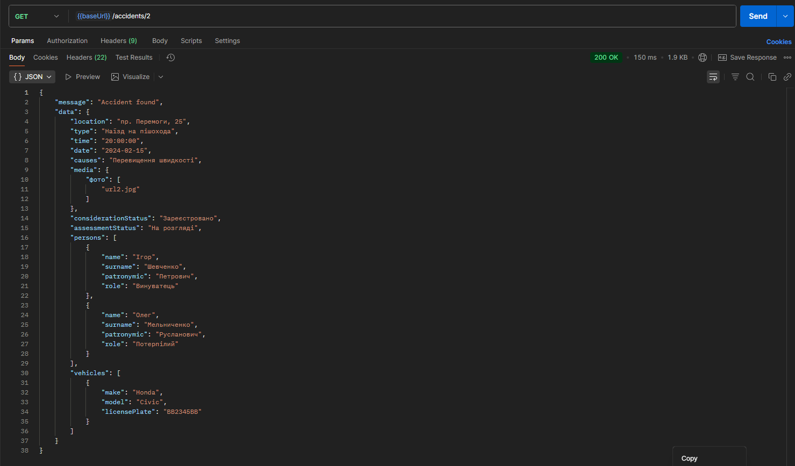

# Лабораторно-практична робота №5

### «Розширення бекенд-додатку власними сутностями та реалізація REST API»

---

## Реалізовані сутності та їх зв’язки

### Діаграма інформаційної системи


### Опис

- **Accident** — містить усі дані специфічні до ДТП
- **Person** — містить інформацію про персону
- **Vehicle** — містить інформацію про транспортний засіб
- Було також реалізовано усі інші сутності з діаграми

**Зв’язок:** ManyToMany між Accident-Person та Accident-Vehicle. OneToOne між Person-Vehicle.

---

## Реалізовані API ендпоінти

### Accident

- `POST /v1/accidents` — створення запису
- `GET /v1/accidents` — отримання всіх записів
- `GET /v1/accidents/:id` — отримання запису за ID
- `PATCH /v1/accidents/:id` — оновлення запису
- `DELETE /v1/accidents/:id` — видалення запису

### Person

- `POST /v1/persons` — створення запису
- `GET /v1/persons` — отримання всіх записів
- `GET /v1/persons/:id` — отримання запису за ID
- `PATCH /v1/persons/:id` — оновлення запису
- `DELETE /v1/persons/:id` — видалення запису

### Vehicle

- `POST /v1/vehicle` — створення запису
- `GET /v1/vehicle` — отримання всіх записів
- `GET /v1/vehicle/:id` — отримання запису за ID
- `PATCH /v1/vehicle/:id` — оновлення запису
- `DELETE /v1/vehicle/:id` — видалення запису

---

## Результати тестування (скріншоти Postman)

### Accident

- `POST /v1/accidents`
  

- `GET /v1/accidents`
  

- `GET /v1/accidents/:id`
  

- `PATCH /v1/accidents/:id`
  

- `DELETE /v1/accidents/:id`
  

### Person

- `POST /v1/persons`
  

- `GET /v1/persons`
  

- `GET /v1/persons/:id`
  

- `PATCH /v1/persons/:id`
  

- `DELETE /v1/persons/:id`
  

### Vehicle

- `POST /v1/vehicles`
  

- `GET /v1/vehicles`
  

- `GET /v1/vehicles/:id`
  

- `PATCH /v1/vehicles/:id`
  

- `DELETE /v1/vehicles/:id`
  

---

# Лабораторно-практична робота №6

### «Впровадження сервісного шару, валідації та DTO»

---

## Пояснення структурних шарів проєкту

### Middleware — Валідація

- Перевіряє коректність даних, що надходять від клієнта.
- У разі помилки повертає 400 Bad Request з повідомленням.

**Роль:** Перша лінія захисту. Гарантує, що контролер отримує валідні дані.

### Controller — Оркестрація

- Отримує запит після валідації.
- Викликає потрібний сервіс.
- Формує DTO для відповіді.

**Роль**: Координує потік даних між шаром валідації, бізнес-логікою та клієнтом.

### Service — Бізнес-логіка

- Інкапсулює роботу з репозиторієм.
- Здійснює CRUD-операції.
- Не залежить від HTTP-рівня.

**Роль**: Єдине місце для бізнес-правил.

### Repository — Доступ до даних

- Працює з базою даних через ORM.
- Виноситься з контролера та сервісу.
- Не містить бізнес-логіки.

**Роль**: Єдине місце доступу до бази даних.

---

## Приклади коду

### Приклад коду Middleware

```typescript
import { Request, Response, NextFunction } from 'express';
import validator from 'validator';

import { CustomError } from 'utils/response/custom-error/CustomError';
import { ErrorValidation } from 'utils/response/custom-error/types';

export const validatorCreate = (req: Request, res: Response, next: NextFunction) => {
  let { date, time, location, causes, type, assessmentStatus, considerationStatus, media } = req.body;
  const errorsValidation: ErrorValidation[] = [];

  date = String(date || '');
  time = String(time || '');
  location = String(location || '');
  causes = String(causes || '');
  type = String(type || '');
  assessmentStatus = String(assessmentStatus || '');
  considerationStatus = String(considerationStatus || '');

  if (media !== undefined) {
    media = String(media || '');
    if (!validator.isJSON(media)) {
      errorsValidation.push({ media: 'Media must be a JSON' });
    }
  }

  if (validator.isEmpty(date) || !validator.isDate(date)) {
    errorsValidation.push({ date: 'Proper date is required' });
  }

  if (validator.isEmpty(time)) {
    errorsValidation.push({ time: 'Proper time is required' });
  }

  if (validator.isEmpty(location)) {
    errorsValidation.push({ location: 'Location is required' });
  }

  if (validator.isEmpty(causes)) {
    errorsValidation.push({ causes: 'Causes are required' });
  }

  if (validator.isEmpty(type)) {
    errorsValidation.push({ type: 'Type is required' });
  }

  if (validator.isEmpty(assessmentStatus)) {
    errorsValidation.push({ assessmentStatus: 'Assessment status is required' });
  }

  if (validator.isEmpty(considerationStatus)) {
    errorsValidation.push({ considerationStatus: 'Consideration status is required' });
  }

  if (errorsValidation.length > 0) {
    const customError = new CustomError(400, 'Validation', 'Create validation error', null, null, errorsValidation);
    return next(customError);
  }
  return next();
};
```

### Приклад коду DTO

```typescript
import { Accident } from '../orm/entities/accidents/Accident';
import { AssessmentStatus, ConsiderationStatus } from '../orm/entities/accidents/enums';

import { NestedPersonDto } from './NestedPersonDto';
import { NestedVehicleDto } from './NestedVehicleDto';

export class AccidentDto {
  date: Date;
  media: string;
  location: string;
  causes: string;
  considerationStatus: ConsiderationStatus;
  assessmentStatus: AssessmentStatus;
  type: string;
  time: string;
  persons?: NestedPersonDto[];
  vehicles?: NestedVehicleDto[];

  constructor(accident: Accident) {
    this.location = accident.Місце;
    this.type = accident.Тип;
    this.time = accident.Час;
    this.date = accident.Дата;
    this.causes = accident.Причини;
    this.media = accident.Медіа;
    this.considerationStatus = accident.Статус_розгляду;
    this.assessmentStatus = accident.Статус_оцінки;
    this.persons = accident.Персони?.map((person) => new NestedPersonDto(person));
    this.vehicles = accident.Транспортні_засоби?.map((vehicle) => new NestedVehicleDto(vehicle));
  }
}
```

### Приклад коду Service

```typescript
import { getRepository } from 'typeorm';

import { Accident } from '../orm/entities/accidents/Accident';
import { CustomError } from '../utils/response/custom-error/CustomError';

export class AccidentService {
  async show(id: string) {
    const accidentRepository = getRepository(Accident);
    const accident = await accidentRepository
      .createQueryBuilder('accident')
      .leftJoinAndSelect('accident.Персони', 'accidentPerson')
      .leftJoinAndSelect('accidentPerson.Персона', 'person')
      .leftJoinAndSelect('accident.Транспортні_засоби', 'accidentVehicle')
      .leftJoinAndSelect('accidentVehicle.Транспортний_засіб', 'vehicle')
      .select(['accident', 'accidentPerson', 'person', 'accidentVehicle', 'vehicle'])
      .where('accident.id = :id', { id: id })
      .getOne();

    if (!accident) {
      throw new CustomError(404, 'General', `Accident with id:${id} not found.`, ['User not found.']);
    }
    return accident;
  }

  async list() {
    const accidentRepository = getRepository(Accident);
    try {
      const accidents = await accidentRepository
        .createQueryBuilder('accident')
        .leftJoinAndSelect('accident.Персони', 'accidentPerson')
        .leftJoinAndSelect('accidentPerson.Персона', 'person')
        .leftJoinAndSelect('accident.Транспортні_засоби', 'accidentVehicle')
        .leftJoinAndSelect('accidentVehicle.Транспортний_засіб', 'vehicle')
        .select(['accident', 'accidentPerson', 'person', 'accidentVehicle', 'vehicle'])
        .getMany();
      return accidents;
    } catch (err) {
      throw new CustomError(400, 'Raw', `Can't retrieve list of accidents.`, null, err);
    }
  }

  async edit(id: string, requestBody: any) {
    const { date, media, location, causes, assessmentStatus, considerationStatus, type, time } = requestBody;

    const accidentRepository = getRepository(Accident);
    const accident = await accidentRepository.findOne({ where: { id } });

    if (!accident) {
      throw new CustomError(404, 'General', `Accident with id:${id} not found.`, ['Accident not found.']);
    }

    accident.Дата = date;
    accident.Медіа = media;
    accident.Місце = location;
    accident.Причини = causes;
    accident.Статус_оцінки = assessmentStatus;
    accident.Статус_розгляду = considerationStatus;
    accident.Тип = type;
    accident.Час = time;

    try {
      await accidentRepository.save(accident);
      return accident;
    } catch (err) {
      throw new CustomError(409, 'Raw', `Accident can't be saved.`, null, err);
    }
  }

  async destroy(id: string) {
    const accidentRepository = getRepository(Accident);
    const accident = await accidentRepository.findOne({ where: { id } });

    if (!accident) {
      throw new CustomError(404, 'General', 'Not Found', [`Accident with id:${id} doesn't exists.`]);
    }
    await accidentRepository.delete(id);

    return accident;
  }

  async create(requestBody: any) {
    const { date, time, location, causes, type, media, assessmentStatus, considerationStatus } = requestBody;

    try {
      const accidentRepository = getRepository(Accident);

      const newAccident = accidentRepository.create({
        Дата: date,
        Час: time,
        Місце: location,
        Причини: causes,
        Тип: type,
        Медіа: media,
        Статус_оцінки: assessmentStatus,
        Статус_розгляду: considerationStatus,
      });

      await accidentRepository.save(newAccident);
      return newAccident;
    } catch (err) {
      throw new CustomError(400, 'Raw', 'Error creating accident.', null, err);
    }
  }
}
```

---

## Скріншоти Postman

- Запит з некоректними даними
  

- Успішний запит
  
